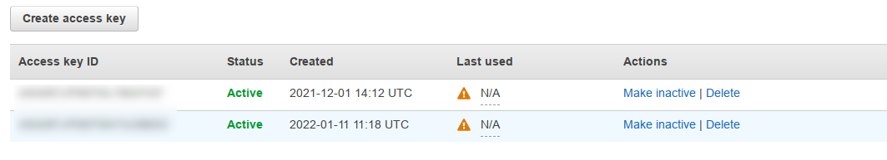

# Docker + AWS + Ansible

### Diversion task: Changing the Keys

First task of the day was to create another key for myself to utilise.
The point of doing this is, if a breach or compromise of one key occurs another one is spare to be utilised.

Navigate: Search for **IAM** -> **My security credentials** -> *"Create access key"*

 

This is where creation and deletion of the access codes can be made.

#### Ansible

After AWS keys have been configured, the proceeding task would be then to update the keys within ansibles *pass.yml*

My steps go as follow:
*Onto my vagrant controller*, navigate: */etc/ansible/public_var/all/*
within this directory we can see the *pass.yml* file.
We can now approach this file with the command: `sudo ansible-vault edit pass.yml` as accessing the file by normal means will output, garbled encryption

## EC2 instance with Ansible

To do this a playbook needs to be created first in ansible.

```ansible
---

- name: EC2 Making an instance
  hosts: local
  gather_facts: yes
  connection: local
  become: true

  tasks:
    - name: Inputting the setting for EC2
      tags: eng99_ivan_ansible
      ec2:
        aws_access_key: "{{aws_access_key}}"
        aws_secret_key: "{{aws_secret_key}}"
        key_name: eng99
        image: ami-07d8796a2b0f8d29c
        group_id: sg-09727510cb431c8cf
        instance_type: t2.micro
        vpc_subnet_id: subnet-05b84fc5570a5152b
        region: eu-west-1
        count: 1
        wait: yes
        assign_public_ip: yes

        instance_tags:
          Name: eng99_ivan_ansible

```
